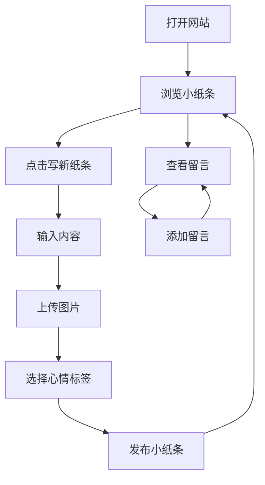

## 1. 产品概述
企鹅小纸条是一个记录开心与心情的私人分享空间，用户可以发布小纸条并与朋友互动。
- 主要功能是让用户记录日常生活中的开心事和心情，分享给朋友并获得互动。
- 目标用户是希望记录生活点滴并与朋友分享的个人用户。

## 2. 核心功能

### 2.1 用户角色
| 角色 | 注册方式 | 核心权限 |
|------|--------|----------|
| 普通用户 | 无需注册 | 发布小纸条、上传图片、浏览内容、留言互动 |

### 2.2 功能模块
1. **首页**：展示所有已发布的小纸条、写新纸条按钮、固定角色元素区域
2. **发布小纸条**：弹窗形式，输入文字、上传图片、选择心情标签
3. **留言功能**：每条小纸条下方的留言列表和输入框

### 2.3 页面详情
| 页面名称 | 模块名称 | 功能描述 |
|---------|---------|----------|
| 首页 | 小纸条列表 | 按时间倒序展示所有小纸条，包含用户头像、昵称、发布时间、文字内容、图片、留言区 |
| 首页 | 写新纸条按钮 | 醒目的按钮，点击后弹出发布窗口 |
| 首页 | 固定角色元素 | 页面右侧或左侧固定卡片，展示人物图片，可上传替换但不可更改 |
| 发布小纸条 | 输入区域 | 文本输入框，可输入小纸条内容 |
| 发布小纸条 | 图片上传 | 支持上传1-3张图片 |
| 发布小纸条 | 心情标签 | 可选择心情标签（开心/激动/平静/治愈等） |
| 发布小纸条 | 发布按钮 | 点击后发布小纸条并关闭弹窗 |
| 留言功能 | 留言列表 | 展示所有留言，包含留言者昵称和时间 |
| 留言功能 | 留言输入框 | 输入框和提交按钮，用于添加新留言 |

## 3. 核心流程
用户打开网站，浏览现有的小纸条，点击写新纸条按钮，输入内容、上传图片、选择心情标签，点击发布后小纸条会显示在首页。其他用户可以浏览小纸条并在下方留言互动。

## 4. 用户界面设计
### 4.1 设计风格
- 主色调：浅蓝色(#A7D7E8)和白色(#FFFFFF)，辅助色：橙色(#FFB347)和粉色(#FFB6C1)
- 按钮风格：圆角按钮，带有企鹅元素，圆滚滚的设计
- 字体：无衬线字体，主标题18-24px，正文14-16px
- 布局风格：卡片式布局，类似于手账/小纸条的感觉
- 图标/表情风格：可爱的企鹅图标，圆润的设计风格

### 4.2 页面设计概览
| 页面名称 | 模块名称 | UI元素 |
|---------|---------|--------|
| 首页 | 小纸条列表 | 卡片式设计，圆角边框，浅色背景，企鹅小图标装饰，时间显示在角落 |
| 首页 | 写新纸条按钮 | 醒目的圆形按钮，企鹅造型，位于页面右下角 |
| 首页 | 固定角色元素 | 右侧固定卡片，圆角设计，背景为浅色，人物图片居中显示 |
| 发布小纸条 | 弹窗 | 圆角边框，浅色背景，顶部有企鹅图标，底部有发布按钮 |
| 留言功能 | 留言列表 | 气泡式设计，左侧显示昵称，右侧显示留言内容和时间 |
| 留言功能 | 留言输入框 | 圆角输入框，旁边有发送按钮，带有企鹅元素 |

### 4.3 响应式设计
- 采用移动优先的响应式设计
- 桌面端：固定角色元素在右侧，小纸条列表在左侧
- 移动端：固定角色元素在顶部，小纸条列表在下方
- 触摸优化：按钮和可点击区域较大，适合触摸操作

### 4.4 3D场景指导（不适用）
- 本项目不包含3D场景