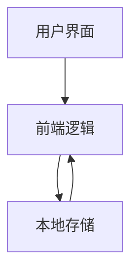
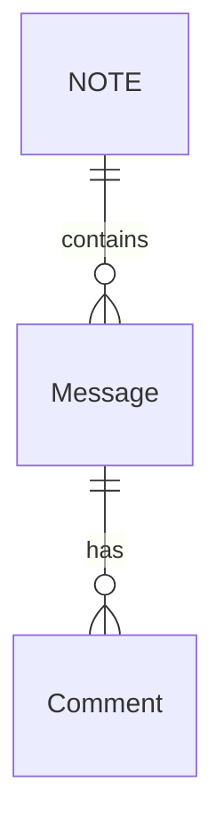

## 1. 架构设计

## 2. 技术描述
- 前端：纯HTML5 + CSS3 + JavaScript
- 数据存储：localStorage
- 响应式设计：使用CSS Media Queries
- 图片处理：使用FileReader API

## 3. 页面结构
| 页面 | 功能 |
|------|------|
| index.html | 主页面，包含所有功能 |

## 4. 数据模型
### 4.1 数据模型定义

### 4.2 数据结构
1. **小纸条(Message)**：
   - id: 唯一标识符
   - content: 文字内容
   - images: 图片数组（base64编码）
   - mood: 心情标签
   - timestamp: 发布时间
   - author: 作者昵称

2. **留言(Comment)**：
   - id: 唯一标识符
   - messageId: 关联的小纸条ID
   - content: 留言内容
   - author: 留言者昵称
   - timestamp: 留言时间

3. **固定角色元素**：
   - avatar: 人物图片（base64编码）

## 5. 功能实现
### 5.1 本地存储
- 使用localStorage存储数据
- 初始化时检查localStorage是否有数据，无数据则预置示例数据

### 5.2 图片处理
- 使用FileReader API将图片转换为base64编码存储
- 限制图片大小和数量

### 5.3 响应式设计
- 使用CSS Media Queries实现不同屏幕尺寸的布局调整
- 移动端和桌面端的不同布局

### 5.4 动画效果
- 使用CSS动画实现企鹅元素的漂浮效果
- 使用CSS过渡效果实现弹窗和交互元素的动画

## 6. 性能优化
- 图片压缩和优化
- 本地存储数据管理
- 避免不必要的DOM操作

## 7. 代码结构
- index.html: 主页面结构
- style: 内联CSS样式
- script: 内联JavaScript逻辑